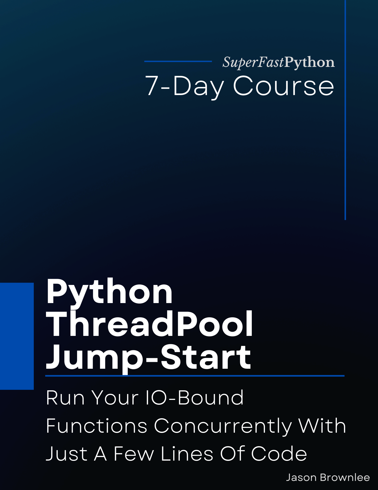

# Python ThreadPool Jump-Start

* <https://github.com/SuperFastPython/PythonThreadPoolJumpStart>

This repository provides all source code for the book:

* **Python ThreadPool Jump-Start**: _Run Your IO-Bound Functions Concurrently With Just A Few Lines Of Code_, Jason Brownlee, 2022.

## Source Code
You can access all Python .py files directly here:

* [src/](src/)

## Get the Book

You can learn more about the book here:

* Coming soon.

### Book Blurb

> How much faster could your Python code run (if you used 100s of threads)?
>
> The ThreadPool class provides easy-to-use thread-based concurrency for IO-bound tasks.
>
> This is not some random third-party library, this is a class provided in the Python standard library (already installed on your system).
>
> This is the class you need to use to make your code run faster.
>
> There's just one problem. No one knows about it (or how to use it well).
>
> Introducing: "Python ThreadPool Jump-Start". A new book designed to teach you thread pools in Python, super fast!
>
> You will get a rapid-paced, 7-part course to get you started and make you awesome at using the ThreadPool.
>
> Each of the 7 lessons was carefully designed to teach one critical aspect of the ThreadPool, with explanations, code snippets and worked examples.
>
> Each lesson ends with an exercise for you to complete to confirm you understood the topic, a summary of what was learned, and links for further reading if you want to go deeper.
>
> Stop copy-pasting code from StackOverflow answers.
>
> Learn Python concurrency correctly, step-by-step.